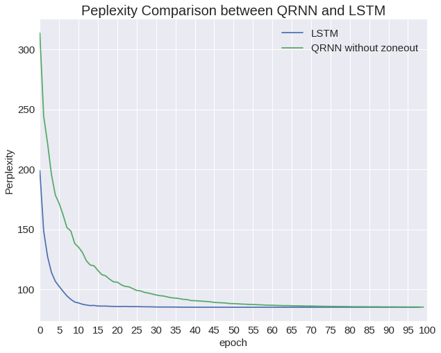

# chainer-qrnn

## About
Re-implementation of Quasi-Recurrent Neural Networks (QRNN) by Chainer.

The original paper is:
>James Bradbury, Stephen Merity, Caiming Xiong, and Richard Socher. 2016. [Quasi-Recurrent Neural Networks](http://arxiv.org/abs/1611.01576)

The original implementation of QRNN (which is also written in Chainer) is publicly available on this [blog post](https://metamind.io/research/new-neural-network-building-block-allows-faster-and-more-accurate-text-understanding/). However, the author only provides so-called "core" implementation, which is only a chunk of code.

Instead, this repository aims to offer full-implementation of QRNN.

## Implementation Details
### What is included
* QRNN with fo-pooling architecture (`bin/QRNNLM/net/model.py`)
* Scripts for language modeling experiment (`bin/QRNNLM/train_qrnn.py`)

### What is not included
* QRNN Encoder-Decoder model

## Dependencies
* Python 3.5
* Chainer 1.21.0

## How to run
### Data Preparation
Download preprocessed version of Penn Tree Bank from [here](http://www.fit.vutbr.cz/˜imikolov/rnnlm/simple-examples.tgz).

Create `data/ptb` directory at the same level as `bin` and copy downloaded data (`train.txt` `valid.txt` `test.txt`) in it.

### Training
Train the model with following command.
```
python train_qrnn.py --gpu <gpu_id> --epoch 100 --dim 640 --batchsize 20 --bproplen 105 --unit 640 --decay 0.0002
```

### Testing
For computing the perplexity with the test set, use `eval_qrnn.py`
```
python eval_qrnn.py --model-path <path_to_trained_model> --config-path <path_to_settings.json>
```

## Experiment
### Task
Language modeling on MikolovPTB

### Hyper-Parameters
|                    | LSTM   | QRNN   |
|--------------------|--------|--------|
| Number of Layers   | 2      | 2      |
| Hidden Layer Units | 640    | 640    |
| Dropout            | 0.5    | 0.5    |
| Zoneout            | No     | No     |
| Weight Decay       | 0.0002 | 0.0002 |
| GradientClipping   | 5      | 10     |
| Epoch              | 100    | 100    |
| Batchsize          | 20     | 20     |
| BPTT length        | 35     | 105    |

### Result


|      | Dev   | Test  |
|------|-------|-------|
| LSTM | 84.99 | 81.87 |
| QRNN | 85.12 | 81.75 |

On my experiment, LSTM performed better than QRNN.
